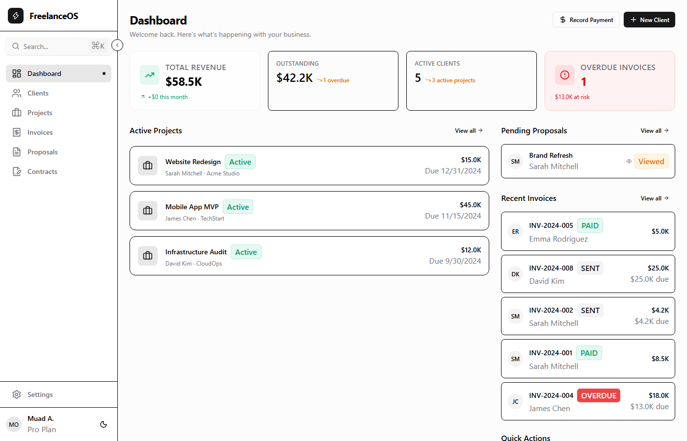
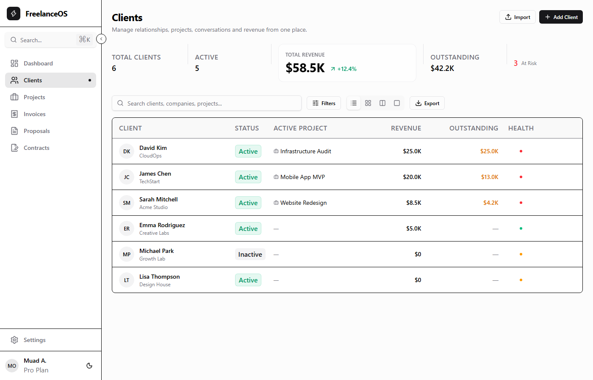
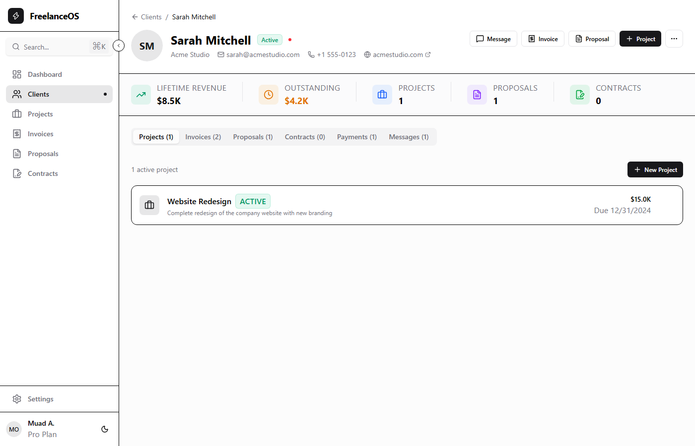
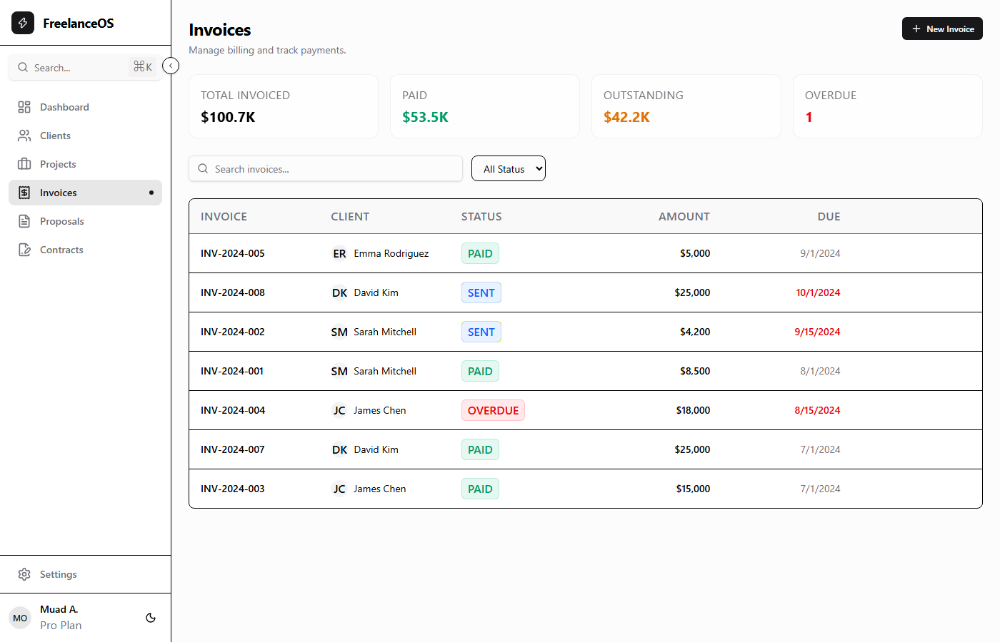
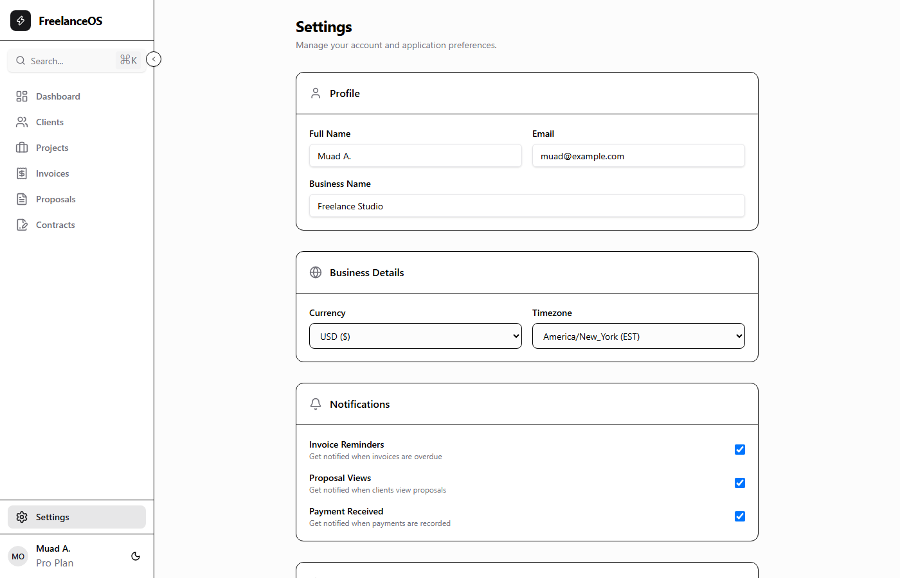

# Freelancer CRM

> Premium client relationship management for freelancers and creative professionals.

**Live Demo:** [https://freelancer-crm-ivory.vercel.app](https://freelancer-crm-ivory.vercel.app)

---

## What is this?

A fully functional CRM built for freelancers — manage clients, projects, invoices, proposals, contracts, and payments from one place.

### Features

- **Dashboard** — Revenue overview, active projects, pending proposals, overdue invoice alerts
- **Clients** — Directory with health scoring, search, filters, and table/card views
- **Projects** — Status tracking, budgets, deadlines, client linking
- **Invoices** — Line items, payment history, record payments, status tracking
- **Proposals** — Dynamic line items, validity tracking
- **Contracts** — Draft → Sent → Signed workflow
- **Settings** — Data export (JSON), dark mode, notification preferences

### Tech Stack

Next.js · Tailwind CSS v4 · Radix UI · React Context · localStorage

---

## Screenshots

### Dashboard

### Clients

### Client Detail

### Invoices

### Settings

---

## Status

Production-ready. Every button, link, form, and interaction is fully wired.

---

*Built with Next.js, Tailwind CSS, and Radix UI.*
